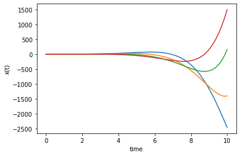

# CT Assignemnt 1

Batalov Artem, BS20-01


```python
from IPython.display import display, Math
import numpy as np

def print_tex(tex):
    display(Math(tex))

def matrix_tex(array):
    matrix = ''
    for row in array:
        try:
            for number in row:
                matrix += f'{number}&'
        except TypeError:
            matrix += f'{row}&'
        matrix = matrix[:-1] + r'\\'
    return r'\begin{bmatrix}'+matrix+r'\end{bmatrix}'

def SS_tex(A):
    return r'\mathbf{\dot{z}} = ' + matrix_tex(A) + r'\mathbf{z}'
```

# Task 1.1: ODE to State Space conversion

Convert to State Space represantation and to a transfer function representation

* $10 y^{(4)} -7  y^{(3)} + 2   \ddot y + 0.5 \dot y + 4y  = 15 u$  
  
State Space representation: 
$$
\mathbf{\dot{z}} = 
\begin{bmatrix}
0 & 1 & 0 & 0\\
0 & 0 & 1 & 0\\
0 & 0 & 0 & 1\\
-0.4 & -0.05 & -0.2 & 0.7
\end{bmatrix}
\mathbf{z} + 
\begin{bmatrix}
0 \\
0 \\
0 \\
1.5
\end{bmatrix}
u
$$
  
Transfer function: 
$$
W(s)=\frac{15}{10s^4-7s^3+2s^2+0.5s+4}
$$
<br/><br/>

* $5  y^{(4)} -17 y^{(3)} - 3   \ddot y + 1.5 \dot y + 2y  = 25 u$  
State Space representation: 
$$
\mathbf{\dot{z}} = 
\begin{bmatrix}
0 & 1 & 0 & 0\\
0 & 0 & 1 & 0\\
0 & 0 & 0 & 1\\
-0.4 & -0.3 & 0.6 & 3.4
\end{bmatrix}
\mathbf{z} + 
\begin{bmatrix}
0 \\
0 \\
0 \\
5
\end{bmatrix}
u
$$
Transfer function: 
$$
W(s)=\frac{25}{5 s^4 - 17 s^3 - 3 s^2 + 1.5 s + 2}
$$
<br/><br/>

* $-3 y^{(4)} +22 y^{(3)} + 4   \ddot y + 1.5 \dot y + 1y  = 15 u$  
State Space representation: 
$$
\mathbf{\dot{z}} = 
\begin{bmatrix}
0 & 1 & 0 & 0\\
0 & 0 & 1 & 0\\
0 & 0 & 0 & 1\\
\frac{1}{3} & 0.5 & \frac{4}{3} & \frac{22}{3}
\end{bmatrix}
\mathbf{z} + 
\begin{bmatrix}
0 \\
0 \\
0 \\
-5
\end{bmatrix}
u
$$
Transfer function: 
$$
W(s)=\frac{15}{-3 s^4 + 22 s^3 + 4 s^2 + 1.5 s + 1}
$$
<br/><br/>

* $5  y^{(4)} -17 y^{(3)} - 1.5 \ddot y + 100 \dot y + 1.1y= 45 u$  
State Space representation: 
$$
\mathbf{\dot{z}} = 
\begin{bmatrix}
0 & 1 & 0 & 0\\
0 & 0 & 1 & 0\\
0 & 0 & 0 & 1\\
-0.22 & -20 & 0.3 & 3.4
\end{bmatrix}
\mathbf{z} + 
\begin{bmatrix}
0 \\
0 \\
0 \\
9
\end{bmatrix}
u
$$
Transfer function: 
$$
W(s)=\frac{45}{5 s^4 - 17 s^3 - 1.5 s^2 + 100 s + 1.1}
$$
<br/><br/>

* $1.5y^{(4)} -23 y^{(3)} - 2.5 \ddot y + 0.1 \dot y + 100y= -10 u$  
State Space representation: 
$$
\mathbf{\dot{z}} = 
\begin{bmatrix}
0 & 1 & 0 & 0\\
0 & 0 & 1 & 0\\
0 & 0 & 0 & 1\\
-\frac{200}{3} & -\frac{1}{15} & \frac{5}{3} & \frac{46}{3}
\end{bmatrix}
\mathbf{z} + 
\begin{bmatrix}
0 \\
0 \\
0 \\
-\frac{20}{3}
\end{bmatrix}
u
$$
Transfer function: 
$$
W(s)=\frac{-10}{1.5 s^4 - 23 s^3 - 2.5 s^2 + 0.1 s + 100}
$$

# Task 1.2 (higher difficulty)

Convert the following to a second order ODE and to a transfer function representation:

## Init code


```python
from sympy import *

I = eye(2)
x = var('x', real = True)
s = var('s', real = True)

C = Matrix( [[1, 0]]) # For all of the above ... 
```

## 1
$$\dot x = 
\begin{pmatrix} 1 & 0 \\ -5 & -10
\end{pmatrix}
x
+ \begin{pmatrix} 0 \\ 1
\end{pmatrix} u
$$


  

Let's check with Python. 


```python
A = Matrix( [[ 1, 0],
             [ -5, -10]])
B = Matrix( [[ 0],
             [ 1]])
C = Matrix( [[1, 0]])

W = (C*((s * I - A)**-1)*B)[0,0].simplify()
print_tex(r'W(s) = ' + latex(W))
```


$$W(s) = 0$$


Cannot calculate the equation with this TF. 

Let's check $det(s\mathbf{I} -\mathbf{A})$. It is denominator of our TF. 


```python
det(s * I - A)
```


$\displaystyle s^{2} + 9 s - 10$


It means that in the left part we have $\ddot x + 9 \dot x - 10x$ (Inverse Laplace), and 0 in the right part.

The equation is $\ddot x + 9 \dot x - 10x = 0$

## 2
$$\dot x = 
\begin{pmatrix} 0 & 8 \\ 1 & 3
\end{pmatrix}
x
+ \begin{pmatrix} 0 \\ 1
\end{pmatrix} u
$$


```python
A = Matrix( [[ 0, 8],
             [ 1, 3]])
B = Matrix( [[ 0],
             [ 1]])

W = (C*((s * I - A)**-1)*B)[0,0].simplify()
print_tex(r'W(s) = ' + latex(W))
```


$$W(s) = \frac{8}{s^{2} - 3 s - 8}$$


The equation is $\ddot x - 3 \dot x - 8x = 8u$

## 3
$$\dot x = 
\begin{pmatrix} 0 & 8 \\ 6 & 0
\end{pmatrix}
x
+ \begin{pmatrix} 0 \\ 1
\end{pmatrix} u
$$


```python
A = Matrix( [[ 0, 8],
             [ 6, 0]])
B = Matrix( [[ 0],
             [ 1]])

W = (C*((s * I - A)**-1)*B)[0,0].simplify()
print_tex(r'W(s) = ' + latex(W))
```


$$W(s) = \frac{8}{s^{2} - 48}$$


The equation is $\ddot x - 48x = 8u$

## 4
$$\dot x = 
\begin{pmatrix} 0 & 1 \\ 6 & 3
\end{pmatrix}
x
+ \begin{pmatrix} 0 \\ 1
\end{pmatrix} u
$$


```python
A = Matrix( [[ 0, 1],
             [ 6, 3]])
B = Matrix( [[ 0],
             [ 1]])

W = (C*((s * I - A)**-1)*B)[0,0].simplify()
print_tex(r'W(s) = ' + latex(W))
```


$$W(s) = \frac{1}{s^{2} - 3 s - 6}$$


The equation is $ \ddot x - 3 \dot x - 6x = u$

# Task 1.3 Implement Euler Integration or Runge-Kutta Integration scheme, solve the equation from the Task 1 using it.

Concidering first equation from task 1.1:
$$10 y^{(4)} -7  y^{(3)} + 2   \ddot y + 0.5 \dot y + 4y  = 15 u$$

State Space representation: 
$$
\mathbf{\dot{z}} = 
\begin{bmatrix}
0 & 1 & 0 & 0\\
0 & 0 & 1 & 0\\
0 & 0 & 0 & 1\\
-0.4 & -0.05 & -0.2 & 0.7
\end{bmatrix}
\mathbf{z} + 
\begin{bmatrix}
0 \\
0 \\
0 \\
1.5
\end{bmatrix}
u
$$

Set simulation time to $10s$, random initial state. 


```python
import numpy as np

# x_dot from state space
def StateSpace(x, t, A, B):
  return np.dot(A,x)+B

n = 4
A = np.array([[0,1,0,0], 
              [0,0,1,0], 
              [0,0,0,1], 
              [-0.4,-0.05,-0.2,0.7]])

B = np.array([0, 0, 0, 1.5])

t = np.linspace(0, 10, 1000) 

# x0 = np.array([0] * n)  # initial state
x0 = np.random.rand(n)  # random initial state
```

### `odeint()` method (something like Runge-Kutta)


```python
from scipy.integrate import odeint
solution = odeint(StateSpace, x0, t, args=(A,B))

import matplotlib.pyplot as plt
plt.plot(t, solution)
plt.xlabel('time')
plt.ylabel('x(t)')

plt.show()
```


    

    


### Euler method (my implementation)


```python
solution = []
dt = t[1] - t[0]
x = x0
for tk in t:
    xk = x + dt * StateSpace(x, tk, A, B)
    solution.append(xk)
    x = xk

import matplotlib.pyplot as plt
plt.plot(t, solution)
plt.xlabel('time')
plt.ylabel('x(t)')

plt.show()
```


    

    


# Task 2.1, convert to state space and simulate

## Init code


```python
from IPython.display import display, Math
import numpy as np

def print_tex(tex):
    display(Math(tex))

def matrix_tex(array):
    matrix = ''
    for row in array:
        try:
            for number in row:
                matrix += f'{number}&'
        except TypeError:
            matrix += f'{row}&'
        matrix = matrix[:-1] + r'\\'
    return r'\begin{bmatrix}'+matrix+r'\end{bmatrix}'

def SS_tex(A):
    return r'\mathbf{\dot{z}} = ' + matrix_tex(A) + r'\mathbf{z}'

# x_dot from state space
def StateSpace(x, t, A):
  return np.dot(A,x)

n = 5

t = np.linspace(0, 10, 1000) 

# x0 = np.array([0] * n)  # initial state
x0 = np.random.rand(n)  # random initial state

def plot(A):
    from scipy.integrate import odeint
    solution = odeint(StateSpace, x0, t, args=(A,))

    import matplotlib.pyplot as plt
    plt.plot(t, solution)
    plt.xlabel('time')
    plt.ylabel('x(t)')

    plt.show()
```

## 1
Concider the following equation:
$$10 y^{(5)} + 10 y^{(4)} -7  y^{(3)} + 2   \ddot y + 0.5 \dot y + 4y  = 0$$


```python
A = np.array([[0,    1,     0,    0,   0], 
              [0,    0,     1,    0,   0], 
              [0,    0,     0,    1,   0], 
              [0,    0,     0,    0,   1], 
              [-0.4, -0.05, -0.2, 0.7, -1]])

print_tex(SS_tex(A))
plot(A)
```


$$\mathbf{\dot{z}} = \begin{bmatrix}0.0&1.0&0.0&0.0&0.0\\0.0&0.0&1.0&0.0&0.0\\0.0&0.0&0.0&1.0&0.0\\0.0&0.0&0.0&0.0&1.0\\-0.4&-0.05&-0.2&0.7&-1.0\\\end{bmatrix}\mathbf{z}$$


    

    


## 2
Concider the following equation:
$$1 y^{(5)} + 5  y^{(4)} -17 y^{(3)} - 3   \ddot y + 1.5 \dot y + 2y  = 0$$


```python
A = np.array([[0,    1,     0,    0,   0], 
              [0,    0,     1,    0,   0], 
              [0,    0,     0,    1,   0], 
              [0,    0,     0,    0,   1], 
              [-2,  -1.5,   3,    17,  -5]])

print_tex(SS_tex(A))
plot(A)
```


$$\mathbf{\dot{z}} = \begin{bmatrix}0.0&1.0&0.0&0.0&0.0\\0.0&0.0&1.0&0.0&0.0\\0.0&0.0&0.0&1.0&0.0\\0.0&0.0&0.0&0.0&1.0\\-2.0&-1.5&3.0&17.0&-5.0\\\end{bmatrix}\mathbf{z}$$


    

    


## 3
Concider the following equation:
$$6 y^{(5)} -3 y^{(4)}  +22 y^{(3)} + 4   \ddot y + 1.5 \dot y + 1y  = 0$$


```python
A = np.array([[0,    1,     0,    0,   0], 
              [0,    0,     1,    0,   0], 
              [0,    0,     0,    1,   0], 
              [0,    0,     0,    0,   1], 
              [-1/6, -1.5/6, -4/6, -22/6, 3/6]])

print_tex(SS_tex(A))
plot(A)
```


$$\mathbf{\dot{z}} = \begin{bmatrix}0.0&1.0&0.0&0.0&0.0\\0.0&0.0&1.0&0.0&0.0\\0.0&0.0&0.0&1.0&0.0\\0.0&0.0&0.0&0.0&1.0\\-0.16666666666666666&-0.25&-0.6666666666666666&-3.6666666666666665&0.5\\\end{bmatrix}\mathbf{z}$$


    

    


## 4
Concider the following equation:
$$22 y^{(5)} + 5  y^{(4)} -17 y^{(3)} - 1.5 \ddot y + 100 \dot y + 1.1y= 0$$


```python
A = np.array([[0,       1,       0,    0,   0], 
              [0,       0,       1,    0,   0], 
              [0,       0,       0,    1,   0], 
              [0,       0,       0,    0,   1], 
              [-1.1/22, -100/22, 1.5/22, 17/22, -5/22]])

print_tex(SS_tex(A))
plot(A)
```


$$\mathbf{\dot{z}} = \begin{bmatrix}0.0&1.0&0.0&0.0&0.0\\0.0&0.0&1.0&0.0&0.0\\0.0&0.0&0.0&1.0&0.0\\0.0&0.0&0.0&0.0&1.0\\-0.05&-4.545454545454546&0.06818181818181818&0.7727272727272727&-0.22727272727272727\\\end{bmatrix}\mathbf{z}$$


    

    


## 5
Concider the following equation:
$$-10 y^{(5)} + 1.5y^{(4)} -23 y^{(3)} - 2.5 \ddot y + 0.1 \dot y + 100y= 0$$


```python
A = np.array([[0,       1,       0,    0,   0], 
              [0,       0,       1,    0,   0], 
              [0,       0,       0,    1,   0], 
              [0,       0,       0,    0,   1], 
              [10,      0.01,    -0.25, -2.3, 0.15]])

print_tex(SS_tex(A))
plot(A)
```


$$\mathbf{\dot{z}} = \begin{bmatrix}0.0&1.0&0.0&0.0&0.0\\0.0&0.0&1.0&0.0&0.0\\0.0&0.0&0.0&1.0&0.0\\0.0&0.0&0.0&0.0&1.0\\10.0&0.01&-0.25&-2.3&0.15\\\end{bmatrix}\mathbf{z}$$


    

    


# Task 2.2, convert to state space and simulate ($= \sin(t)$)


## Init code


```python
from IPython.display import display, Math
import numpy as np

def SS_tex(A, B):
    return r'\mathbf{\dot{z}} = ' + matrix_tex(A) + r'\mathbf{z} + ' + matrix_tex(B) + r'sin(t)'

# x_dot from state space
def StateSpace(x, t, A, B):
  return np.dot(A,x) + B * np.sin(t)

n = 5

t = np.linspace(0, 10, 1000) 

# x0 = np.array([0] * n)  # initial state
x0 = np.random.rand(n)  # random initial state

def plot(A, B):
    from scipy.integrate import odeint
    solution = odeint(StateSpace, x0, t, args=(A, B))

    import matplotlib.pyplot as plt
    plt.plot(t, solution)
    plt.xlabel('time')
    plt.ylabel('x(t)')

    plt.show()
```

## 1
Concider the following equation:
$$10 y^{(5)} + 10 y^{(4)} -7  y^{(3)} + 2   \ddot y + 0.5 \dot y + 4y    = \sin(t)$$


```python
A = np.array([[0,    1,     0,    0,   0], 
              [0,    0,     1,    0,   0], 
              [0,    0,     0,    1,   0], 
              [0,    0,     0,    0,   1], 
              [-0.4, -0.05, -0.2, 0.7, -1]])
B = np.array([0, 0, 0, 0, 0.1])

print_tex(SS_tex(A, B))
plot(A, B)
```


$$\mathbf{\dot{z}} = \begin{bmatrix}0.0&1.0&0.0&0.0&0.0\\0.0&0.0&1.0&0.0&0.0\\0.0&0.0&0.0&1.0&0.0\\0.0&0.0&0.0&0.0&1.0\\-0.4&-0.05&-0.2&0.7&-1.0\\\end{bmatrix}\mathbf{z} + \begin{bmatrix}0.0\\0.0\\0.0\\0.0\\0.1\\\end{bmatrix}sin(t)$$


    

    


## 2
Concider the following equation:
$$1 y^{(5)} + 5  y^{(4)} -17 y^{(3)} - 3   \ddot y + 1.5 \dot y + 2y    = \sin(t)$$


```python
A = np.array([[0,    1,     0,    0,   0], 
              [0,    0,     1,    0,   0], 
              [0,    0,     0,    1,   0], 
              [0,    0,     0,    0,   1], 
              [-2,  -1.5,   3,    17,  -5]])
B = np.array([0, 0, 0, 0, 1])

print_tex(SS_tex(A, B))
plot(A, B)
```


$$\mathbf{\dot{z}} = \begin{bmatrix}0.0&1.0&0.0&0.0&0.0\\0.0&0.0&1.0&0.0&0.0\\0.0&0.0&0.0&1.0&0.0\\0.0&0.0&0.0&0.0&1.0\\-2.0&-1.5&3.0&17.0&-5.0\\\end{bmatrix}\mathbf{z} + \begin{bmatrix}0\\0\\0\\0\\1\\\end{bmatrix}sin(t)$$


    

    


## 3
Concider the following equation:
$$6 y^{(5)} -3 y^{(4)}  +22 y^{(3)} + 4   \ddot y + 1.5 \dot y + 1y   = \sin(t)$$


```python
A = np.array([[0,    1,     0,    0,   0], 
              [0,    0,     1,    0,   0], 
              [0,    0,     0,    1,   0], 
              [0,    0,     0,    0,   1], 
              [-1/6, -1.5/6, -4/6, -22/6, 3/6]])
B = np.array([0, 0, 0, 0, 1/6])

print_tex(SS_tex(A, B))
plot(A, B)
```


$$\mathbf{\dot{z}} = \begin{bmatrix}0.0&1.0&0.0&0.0&0.0\\0.0&0.0&1.0&0.0&0.0\\0.0&0.0&0.0&1.0&0.0\\0.0&0.0&0.0&0.0&1.0\\-0.16666666666666666&-0.25&-0.6666666666666666&-3.6666666666666665&0.5\\\end{bmatrix}\mathbf{z} + \begin{bmatrix}0.0\\0.0\\0.0\\0.0\\0.16666666666666666\\\end{bmatrix}sin(t)$$


    

    


## 4
Concider the following equation:
$$22 y^{(5)} + 5  y^{(4)} -17 y^{(3)} - 1.5 \ddot y + 100 \dot y + 1.1y  = \sin(t)$$


```python
A = np.array([[0,       1,       0,    0,   0], 
              [0,       0,       1,    0,   0], 
              [0,       0,       0,    1,   0], 
              [0,       0,       0,    0,   1], 
              [-1.1/22, -100/22, 1.5/22, 17/22, -5/22]])

B = np.array([0, 0, 0, 0, 1/22])

print_tex(SS_tex(A, B))
plot(A, B)
```


$$\mathbf{\dot{z}} = \begin{bmatrix}0.0&1.0&0.0&0.0&0.0\\0.0&0.0&1.0&0.0&0.0\\0.0&0.0&0.0&1.0&0.0\\0.0&0.0&0.0&0.0&1.0\\-0.05&-4.545454545454546&0.06818181818181818&0.7727272727272727&-0.22727272727272727\\\end{bmatrix}\mathbf{z} + \begin{bmatrix}0.0\\0.0\\0.0\\0.0\\0.045454545454545456\\\end{bmatrix}sin(t)$$


    

    


## 5
Concider the following equation:
$$-10 y^{(5)} + 1.5y^{(4)} -23 y^{(3)} - 2.5 \ddot y + 0.1 \dot y + 100y  = \sin(t)$$


```python
A = np.array([[0,       1,       0,    0,   0], 
              [0,       0,       1,    0,   0], 
              [0,       0,       0,    1,   0], 
              [0,       0,       0,    0,   1], 
              [10,      0.01,    -0.25, -2.3, 0.15]])
B = np.array([0, 0, 0, 0, -1/10])

print_tex(SS_tex(A, B))
plot(A, B)
```


$$\mathbf{\dot{z}} = \begin{bmatrix}0.0&1.0&0.0&0.0&0.0\\0.0&0.0&1.0&0.0&0.0\\0.0&0.0&0.0&1.0&0.0\\0.0&0.0&0.0&0.0&1.0\\10.0&0.01&-0.25&-2.3&0.15\\\end{bmatrix}\mathbf{z} + \begin{bmatrix}0.0\\0.0\\0.0\\0.0\\-0.1\\\end{bmatrix}sin(t)$$


    

    


# Subtask 2.3 Mass-spring-damper system

Find or derive equations for a mass-spring-damper system with mass 10kg, spting stiffness of 1000 N / m and damping coefficient 1 N s / m, write them in state-space and second order ODE forms, and simulate them.

ODE for this system is:
$$ m\ddot{x}+b\dot{x}+kx = mg$$

$$m = 10kg$$

$$k = 1000 \frac{N}{m}$$

$$b = 1 \frac{N}{m}$$

$$g = 9.81 \frac{m}{s^2}$$


```python
def StateSpace(x, t, A, B):
  return np.dot(A,x)+B

def SS_tex(A, B):
    return r'\mathbf{\dot{z}} = ' + matrix_tex(A) + r'\mathbf{z} + ' + matrix_tex(B)

m = 10
k = 1000
b = 1
g = 9.81

n = 2
A = np.array([[0, 1],
              [-k/m, -b/m]])

B = np.array([0,
              -g])

x0 = np.array([5,
               0])  # initial state

t0 = 0 # Initial time 
tf = 50 # Final time
t = np.linspace(t0, tf, 1000) 

print_tex(SS_tex(A, B))

solution = odeint(StateSpace, x0, t, args=(A,B))

from matplotlib.pyplot import *

subplot(2,1,1)
plot(t, solution[:,0], linewidth=2.0, color = 'red')
grid(color='black', linestyle=':', linewidth=1.0, alpha = 0.7)
grid(True)
xlim([t0, tf])
ylabel(r'Position, ${x}$')

subplot(2,1,2)
plot(t, solution[:,1], linewidth=2.0, color = 'red')
grid(color='black', linestyle=':', linewidth=1.0, alpha = 0.7)
grid(True)
xlim([t0, tf])
ylabel(r'Velocity, ${\dot{x}}$')

xlabel(r'Time, $t$')
show()
```


$$\mathbf{\dot{z}} = \begin{bmatrix}0.0&1.0\\-100.0&-0.1\\\end{bmatrix}\mathbf{z} + \begin{bmatrix}0.0\\-9.81\\\end{bmatrix}$$


    

    


# Task 3.1, Convert to transfer functions

Equation:
$
\begin{cases}
\ddot x + 0.5 \dot x + 4y = u \\
y = 1.5 \dot x + 6 x
\end{cases} 
$

 

After substitution:
$
\ddot x + 6.5 \dot x + 24x = u
$

Transfer function: 
$
W(s)=\frac{1}{s^2 + 6.5s + 24}
$

We can also derive $G(s) = \frac{Y(s)}{U(s)}$  
 

<br />

Equation:
$
\begin{cases}
10 \ddot x + 1.5 \dot x + 8y = 0.5u \\
y = 15 \dot x + 16 x
\end{cases}
$

After substitution:
$
10 \ddot x + 121.5 \dot x + 128x = 0.5u
$

Transfer function: 
$
W(s)=\frac{1}{20s^2 + 243s + 256}
$

<br />

Equation:
$
\begin{cases}
\ddot x + 2 \dot x - 5y = u \\
y = 2.5 \dot x - 7 x
\end{cases}
$

After substitution:
$
\ddot x -10.5 \dot x + 35x = u
$

Transfer function: 
$
W(s)=\frac{1}{s^2 - 10.5s + 35}
$

<br />

Equation:
$
\begin{cases}
\ddot x + 22 \dot x + 10y = 10u \\
y = 10.5 \dot x + 11 x
\end{cases}
$

After substitution:
$
\ddot x + 127 \dot x + 110x = 10u
$

Transfer function: 
$
W(s)=\frac{10}{s^2 + 127s + 110}
$

<br />

# Task 4.1. Find if the following autonomous linear systems are stable.
# Task 4.2 Simulate all of them, to show convergence.


## 1
$$\dot x = 
\begin{pmatrix} 1 & 0 \\ -5 & -10
\end{pmatrix}
x
$$


 


```python
import numpy as np
from numpy.linalg import eig

A = np.array([[1, 0], [-5, -10]]) # state matrix
e, v = eig(A)
print("eigenvalues of A:", e)
```

    eigenvalues of A: [-10.   1.]


One of eigenvalues is positive => system is unstable.

Let's simulate and check.


```python
from scipy.integrate import odeint
import matplotlib.pyplot as plt

def LTI(x, t):
    return A.dot(x)

time = np.linspace(0, 10, 1000)    # interval from 0 to 10
x0 = np.random.rand(2)            # initial state

solution = odeint(LTI, x0, time)

plt.plot(time, solution)
plt.xlabel('time')
plt.ylabel('x(t)')
plt.show()
```


    

    


## 2
$$\dot x = 
\begin{pmatrix} 0 & 8 \\ 1 & 3
\end{pmatrix}
x
$$


```python
import numpy as np
from numpy.linalg import eig

A = np.array([[0, 8], [1, 3]]) # state matrix
e, v = eig(A)
print("eigenvalues of A:", e)
```

    eigenvalues of A: [-1.70156212  4.70156212]


One of eigenvalues is positive => system is unstable.

Let's simulate and check.


```python
from scipy.integrate import odeint
import matplotlib.pyplot as plt

def LTI(x, t):
    return A.dot(x)

time = np.linspace(0, 10, 1000)    # interval from 0 to 10
x0 = np.random.rand(2)            # initial state

solution = odeint(LTI, x0, time)

plt.plot(time, solution)
plt.xlabel('time')
plt.ylabel('x(t)')
plt.show()
```


    

    


## 3
$$\dot x = 
\begin{pmatrix} 0 & 8 \\ 6 & 0
\end{pmatrix}
x
$$


```python
import numpy as np
from numpy.linalg import eig

A = np.array([[0, 8], [6, 0]]) # state matrix
e, v = eig(A)
print("eigenvalues of A:", e)
```

    eigenvalues of A: [ 6.92820323 -6.92820323]


One of eigenvalues is positive => system is unstable.

Let's simulate and check.


```python
from scipy.integrate import odeint
import matplotlib.pyplot as plt

def LTI(x, t):
    return A.dot(x)

time = np.linspace(0, 10, 1000)    # interval from 0 to 10
x0 = np.random.rand(2)            # initial state

solution = odeint(LTI, x0, time)

plt.plot(time, solution)
plt.xlabel('time')
plt.ylabel('x(t)')
plt.show()
```


    

    


## 4
$$\dot x = 
\begin{pmatrix} 0 & 1 \\ 6 & 3
\end{pmatrix}
x
$$


```python
import numpy as np
from numpy.linalg import eig

A = np.array([[0, 1], [6, 3]]) # state matrix
e, v = eig(A)
print("eigenvalues of A:", e)
```

    eigenvalues of A: [-1.37228132  4.37228132]


One of eigenvalues is positive => system is unstable.

Let's simulate and check.


```python
from scipy.integrate import odeint
import matplotlib.pyplot as plt

def LTI(x, t):
    return A.dot(x)

time = np.linspace(0, 10, 1000)    # interval from 0 to 10
x0 = np.random.rand(2)            # initial state

solution = odeint(LTI, x0, time)

plt.plot(time, solution)
plt.xlabel('time')
plt.ylabel('x(t)')
plt.show()
```


    

    


# Task 4.3 Add a constant term to the equation and show via simulation how the point where the system converges changes (two examples are sufficient).

Sadly, all of the systems in Task 4.1 and 4.2 are unstable. I will use other examples from this assignment. 

## 1
Concider a stable system from the example for 4.1 task:
$$\dot x = 
\begin{pmatrix} -1 & 0.4 \\ -20 & -16
\end{pmatrix}
x
$$


```python
import matplotlib.pyplot as plt
import numpy as np
from scipy.integrate import odeint

def StateSpace(x, t, A, B):
  return np.dot(A,x)+B

fig, axs = plt.subplots(2, 2)
fig.set_size_inches(12, 7)

n = 2
A = np.array([[-1, 0.4], [-20, -16]])

t = np.linspace(0, 10, 1000)

# x0 = np.array([0] * n)  # initial state
x0 = np.random.rand(n)  # random initial state

const = (0, 1, 3, 10)

for i, plot in enumerate(axs.flatten()):
    B = np.array([0, const[i]])
    solution = odeint(StateSpace, x0, t, args=(A,B))

    plot.plot(t, solution)
    plot.set_title(f'const = {const[i]}')
    plot.set_xlabel('time')
    plot.set_ylabel('x(t)')

plt.tight_layout()
plt.show()
```


    

    


We can see, that position and velocity of stable system depends on constant. Increasing it we can increase offset between that. 

## 2
Concider Mass-spring-damper system from task 2.3


```python
import matplotlib.pyplot as plt
import numpy as np
from scipy.integrate import odeint

def StateSpace(x, t, A, B):
  return np.dot(A,x)+B

fig, axs = plt.subplots(2, 2)
fig.set_size_inches(12, 7)


m = 10
k = 1000
b = 1
g = 9.81

n = 2
A = np.array([[0, 1],
              [-k/m, -b/m]])

t = np.linspace(0, 100, 1000)

x0 = np.array([1,0])  # initial state

const = (0, -5, -9.81, -500)

for i, plot in enumerate(axs.flatten()):
    B = np.array([0, const[i]])
    solution = odeint(StateSpace, x0, t, args=(A,B))

    plot.plot(t, solution)
    plot.set_title(f'const = {const[i]}')
    plot.set_xlabel('time')
    plot.set_ylabel('x(t)')

plt.tight_layout()
plt.show()
```


    

    


We also can see, that final position and velocity of stable system depends on constant. (Speed is orange, position is blue)

But if we have big gravitation const, the position of our system will have bigger value when speed tends to zero. It is pretty obvious from the physical side. 
